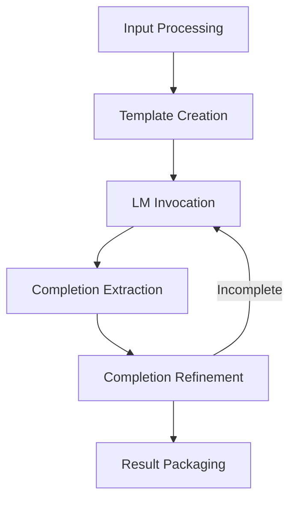

Here's a combined document with an overview, mermaid diagram, and detailed discussion of the prediction flow:

# DSPy Predictor Forward Method

The `forward()` method is a core component of DSPy predictors, responsible for generating completions based on a given signature and inputs. It orchestrates the process of transforming input data into structured predictions using language models (LMs). This method handles input processing, LM invocation, completion extraction, and result packaging, providing a flexible and powerful interface for natural language tasks.



## Detailed Prediction Flow

1. **Input Processing**
   - Validates input arguments against the signature
   - Combines inputs with provided demonstrations
   ```python
   x = dsp.Example(demos=demos, **kwargs)
   if not all(k in kwargs for k in signature.input_fields):
       print("WARNING: Not all input fields were provided to module.")
   ```

2. **Template Creation**
   - Converts the signature into a DSP template for generation
   ```python
   template = signature_to_template(signature)
   ```

3. **LM Invocation**
   - Calls the language model with the prepared prompt and configuration
   ```python
   if self.lm is None:
       x, C = dsp.generate(template, **config)(x, stage=self.stage)
   else:
       with dsp.settings.context(lm=self.lm, query_only=True):
           x, C = dsp.generate(template, **config)(x, stage=self.stage)
   ```

4. **Completion Extraction**
   - Processes raw LM output to extract structured completions
   ```python
   completions: list[dict[str, Any]] = generator(prompt, **kwargs)
   completions: list[Example] = [template.extract(example, p) for p in completions]
   ```

5. **Completion Refinement**
   - Filters and ranks completions based on completeness
   - Handles partial completions through recursive generation
   ```python
   if last_field_idx < len(field_names):
       completion = completions[0]
       completion[field_names[last_field_idx]] = ""
       max_tokens = min(max(75, max_tokens // 2), max_tokens)
       new_kwargs = {
           **kwargs,
           max_tokens_key: max_tokens,
           "n": 1,
           "temperature": 0.0,
       }
       return generate(template, **new_kwargs)(
           completion,
           stage=stage,
           max_depth=max_depth - 1,
           original_example=original_example,
       )
   ```

6. **Result Packaging**
   - Wraps final completions in a `Prediction` object
   ```python
   completions = []
   for c in C:
       completions.append({})
       for field in template.fields:
           if field.output_variable not in kwargs.keys():
               completions[-1][field.output_variable] = getattr(
                   c,
                   field.output_variable,
               )
   pred = Prediction.from_completions(completions, signature=signature)
   ```

This process flow enables DSPy predictors to handle a wide range of natural language tasks, from simple text generation to complex multi-step reasoning. The `forward()` method's flexibility allows it to adapt to different signatures, language models, and configuration parameters, making it a powerful tool for building and optimizing language model applications.