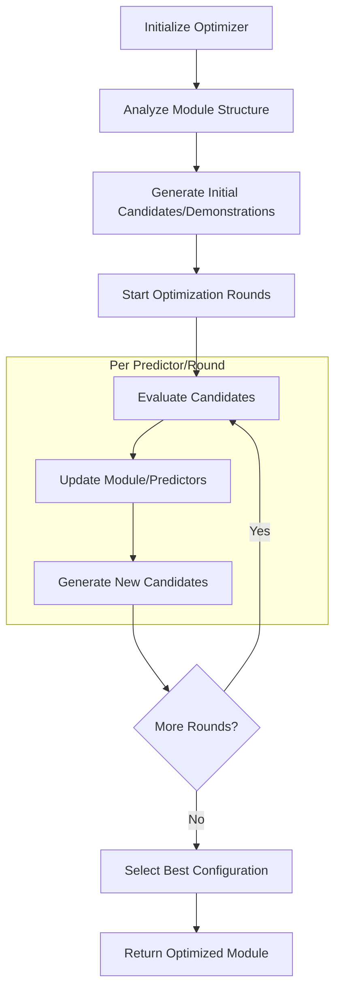

# DSPy Optimizers: Enhancing Module Performance

DSPy optimizers, formerly known as teleprompters, are powerful tools designed to improve the performance of language model-based modules. They work by refining instructions, generating optimal demonstrations, and fine-tuning the overall structure of DSPy programs. Two key optimizers in DSPy are BootstrapFewShot and COPRO (Collaborative Prompt Optimization).

## Core Concepts

1. **Module Interaction**: Optimizers work directly with DSPy modules, analyzing their structure, predictors, and signatures.
2. **Iterative Improvement**: Both optimizers use multiple rounds or depths of optimization to progressively enhance module performance.
3. **Metric-Guided Optimization**: Optimizers rely on task-specific metrics to evaluate and guide the optimization process.
4. **Demonstration Generation**: Optimizers create new, high-quality demonstrations to improve predictor performance.

## Optimization Workflow



## BootstrapFewShot Optimizer

### Key Features
- Generates bootstrapped demonstrations for each predictor
- Uses a teacher model (which can be the same as the student model) to create demonstrations
- Supports multiple rounds of optimization

### Workflow
1. **Preparation**
   - Initializes student and teacher models
   - Prepares predictor mappings between student and teacher

2. **Bootstrapping**
   - Generates demonstrations for each predictor using the teacher model
   - Evaluates generated demonstrations using the provided metric
   - Collects successful demonstrations for each predictor

3. **Training**
   - Combines bootstrapped demonstrations with existing labeled demonstrations
   - Assigns optimized demonstrations to each predictor in the student model

### Example Usage
```python
teleprompter = BootstrapFewShot(metric=metric, max_bootstrapped_demos=4, max_labeled_demos=16)
optimized_student = teleprompter.compile(student, teacher=teacher, trainset=trainset)
```

## COPRO Optimizer

### Key Features
- Generates and refines instructions for each predictor
- Uses a prompt model to create new instruction candidates
- Supports multiple depths of optimization with breadth exploration

### Workflow
1. **Initialization**
   - Sets up optimization parameters (breadth, depth, temperature)
   - Prepares evaluation function and statistical tracking

2. **Candidate Generation**
   - Creates initial instruction candidates for each predictor
   - Uses `BasicGenerateInstruction` for zero-shot generation

3. **Iterative Optimization**
   - For each depth:
     - Evaluates all candidates for each predictor
     - Updates module with best-performing instructions
     - Generates new candidates based on performance history
   - Uses `GenerateInstructionGivenAttempts` for subsequent rounds

4. **Final Selection**
   - Chooses the best overall program configuration
   - Returns optimized module with additional metadata

### Example Usage
```python
teleprompter = COPRO(prompt_model=prompt_model, metric=metric, breadth=10, depth=3)
optimized_module = teleprompter.compile(student.deepcopy(), trainset=trainset, eval_kwargs=kwargs)
```

Here's the updated Shared Optimization Techniques section with relevant code quotes from each optimizer:

## Shared Optimization Techniques

1. **Module Structure Analysis**
   - Both optimizers examine the structure of input modules, identifying individual predictors and their relationships.
   
   BootstrapFewShot:
   ```python
   def _prepare_predictor_mappings(self):
       for (name1, predictor1), (name2, predictor2) in zip(student.named_predictors(), teacher.named_predictors()):
           assert name1 == name2, "Student and teacher must have the same program structure."
           assert predictor1.signature.equals(predictor2.signature), f"Student and teacher must have the same signatures."
   ```
   
   COPRO:
   ```python
   for predictor in module.predictors():
       basic_instruction = self._get_signature(predictor).instructions
       basic_prefix = self._get_signature(predictor).fields[last_key].json_schema_extra['prefix']
   ```

2. **Predictor Signature Utilization**
   - Leverage predictor signatures to understand input and output fields.
   
   BootstrapFewShot:
   ```python
   def _bootstrap_one_example(self, example, round_idx=0):
       for step in trace:
           predictor, inputs, outputs = step
           demo = Example(augmented=True, **inputs, **outputs)
   ```
   
   COPRO:
   ```python
   def _set_signature(self, predictor, updated_signature):
       if (hasattr(predictor, 'extended_signature')):
           predictor.extended_signature = updated_signature
       elif (hasattr(predictor, 'signature')):
           predictor.signature = updated_signature
   ```

3. **Metric-Guided Optimization**
   - Use provided metrics to evaluate the quality of generated demonstrations or instruction candidates.
   
   BootstrapFewShot:
   ```python
   if self.metric:
       metric_val = self.metric(example, prediction, trace)
       if self.metric_threshold:
           success = metric_val >= self.metric_threshold
       else:
           success = metric_val
   ```
   
   COPRO:
   ```python
   score = evaluate(module_clone, devset=trainset, **eval_kwargs)
   ```

4. **Iterative Refinement**
   - Both optimizers use multiple rounds or depths to progressively improve module performance.
   
   BootstrapFewShot:
   ```python
   for round_idx in range(self.max_rounds):
       for example_idx, example in enumerate(tqdm.tqdm(self.trainset)):
           # ... optimization logic ...
   ```
   
   COPRO:
   ```python
   for d in range(self.depth):
       # ... optimization logic ...
   ```

5. **Demonstration/Candidate Management**
   - Maintain pools of high-quality demonstrations or instruction candidates.
   
   BootstrapFewShot:
   ```python
   self.name2traces = {name: [] for name in self.name2predictor}
   # ... later in the code ...
   name2traces[predictor_name].append(demo)
   ```
   
   COPRO:
   ```python
   candidates = {}
   evaluated_candidates = defaultdict(dict)
   # ... later in the code ...
   evaluated_candidates[id(p_old)][(instruction, prefix)] = {
       "score": score,
       "program": module_clone.deepcopy(),
       "instruction": instruction,
       "prefix": prefix,
       "depth": d,
   }
   ```


## Advanced Features

1. **Multi-Predictor Coordination**: For modules with multiple predictors, optimizers consider the interplay between predictors to ensure overall module coherence.

2. **Adaptive Strategies**: Optimizers may adjust their behavior based on optimization progress, such as COPRO's slight temperature increase in later rounds.

3. **Statistical Tracking**: Both optimizers can track detailed statistics about the optimization process, providing insights into performance improvements over time.

4. **Customization Options**: Users can adjust various parameters (e.g., number of demonstrations, optimization rounds, temperature) to tailor the optimization process to specific tasks or models.

By leveraging these sophisticated techniques, DSPy optimizers provide powerful tools for enhancing the performance of language model-based modules. They automate the process of refining instructions, generating high-quality demonstrations, and fine-tuning module structures, ultimately leading to more effective and efficient natural language processing applications.