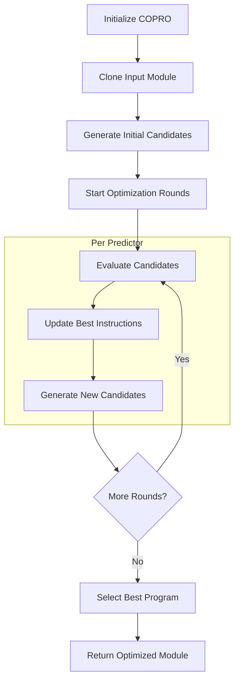

# COPRO: Collaborative Prompt Optimization for Language Models

## Introduction

COPRO (Collaborative Prompt Optimization) is an advanced optimizer in the DSPy framework, designed to enhance the performance of language model-based modules. It employs a sophisticated approach to refine instructions and improve the overall effectiveness of natural language processing tasks. This article delves into the intricacies of COPRO, exploring its methodology, key features, and the underlying mechanisms that drive its optimization process.

## Core Concepts and Workflow

COPRO operates on the principle of iterative refinement, continuously improving instructions through a series of generation and evaluation cycles. The optimizer interacts directly with DSPy modules, analyzing their structure, predictors, and signatures to tailor the optimization process.

The general workflow of COPRO can be visualized as follows:



## Key Features

1. **Instruction Generation and Refinement**: COPRO generates and refines instructions for each predictor in the module.
2. **Multi-Depth Optimization**: Supports multiple depths of optimization with breadth exploration.
3. **Metric-Guided Evaluation**: Uses task-specific metrics to evaluate and guide the optimization process.
4. **Adaptive Strategies**: Implements techniques like temperature adjustment to balance exploration and exploitation.
5. **Statistical Tracking**: Offers detailed performance tracking throughout the optimization process.

## Initialization and Setup

COPRO is initialized with several key parameters:

```python
teleprompter = COPRO(prompt_model=prompt_model, metric=metric, breadth=BREADTH, depth=DEPTH, init_temperature=INIT_TEMPERATURE)
```

- `prompt_model`: The model used for generating new instructions.
- `metric`: The task-specific evaluation metric.
- `breadth`: Number of new prompts to generate at each iteration (default: 10).
- `depth`: Number of optimization rounds (default: 3).
- `init_temperature`: Initial temperature for prompt generation (default: 1.4).

During initialization, COPRO sets up the evaluation function and prepares for statistical tracking if enabled.

## Module Structure Analysis

COPRO begins by examining the structure of the input module, identifying individual predictors and their relationships. This analysis ensures that the optimization process is tailored to the specific architecture of the module:

```python
for predictor in module.predictors():
    basic_instruction = self._get_signature(predictor).instructions
    basic_prefix = self._get_signature(predictor).fields[last_key].json_schema_extra['prefix']
```

## Instruction Generation Process

### Initial Candidate Generation

COPRO starts by generating an initial set of instruction candidates for each predictor. This is done using the `BasicGenerateInstruction` signature:

```python
class BasicGenerateInstruction(Signature):
    """You are an instruction optimizer for large language models. I will give you a ``signature`` of fields (inputs and outputs) in English. Your task is to propose an instruction that will lead a good language model to perform the task well. Don't be afraid to be creative."""

    basic_instruction = dspy.InputField(desc="The initial instructions before optimization")
    proposed_instruction = dspy.OutputField(desc="The improved instructions for the language model")
    proposed_prefix_for_output_field = dspy.OutputField(desc="The string at the end of the prompt, which will help the model start solving the task")
```

The optimizer generates `breadth - 1` new instruction candidates and includes the original instruction as a candidate:

```python
instruct = dspy.Predict(BasicGenerateInstruction, n=self.breadth-1, temperature=self.init_temperature)(basic_instruction=basic_instruction)
instruct.completions.proposed_instruction.append(basic_instruction)
instruct.completions.proposed_prefix_for_output_field.append(basic_prefix)
```

### Iterative Refinement

After the initial generation, COPRO enters an iterative refinement phase. In each iteration (or "depth"), it generates new instruction candidates based on the performance of previous candidates. This is done using the `GenerateInstructionGivenAttempts` signature:

```python
class GenerateInstructionGivenAttempts(dspy.Signature):
    """You are an instruction optimizer for large language models. I will give some task instructions I've tried, along with their corresponding validation scores. The instructions are arranged in increasing order based on their scores, where higher scores indicate better quality.

    Your task is to propose a new instruction that will lead a good language model to perform the task even better. Don't be afraid to be creative."""

    attempted_instructions = dspy.InputField(format=dsp.passages2text)
    proposed_instruction = dspy.OutputField(desc="The improved instructions for the language model")
    proposed_prefix_for_output_field = dspy.OutputField(desc="The string at the end of the prompt, which will help the model start solving the task")
```

The process for generating new instructions in each iteration involves:

1. Sorting previously evaluated candidates by their scores.
2. Creating a list of attempts, including instructions, prefixes, and scores of the best-performing candidates.
3. Using these attempts as input to generate new instruction candidates.

```python
attempts = []
for i in range(shortest_len-1,-1,-1):
    attempts.append(f'Instruction #{shortest_len-i}: {best_predictors[i]["instruction"]}')
    attempts.append(f'Prefix #{shortest_len-i}: {best_predictors[i]["prefix"]}')
    attempts.append(f'Resulting Score #{shortest_len-i}: {best_predictors[i]["score"]}')

instr = dspy.Predict(GenerateInstructionGivenAttempts, n=self.breadth, temperature=self.init_temperature)(attempted_instructions=attempts)
```

## Evaluation and Selection

COPRO evaluates each candidate instruction using the provided metric:

```python
score = evaluate(module_clone, devset=trainset, **eval_kwargs)
```

The best-performing instructions are selected and used to update the module:

```python
best_candidate = max(evaluated_candidates[id(p_old)].values(), key=lambda candidate: candidate['score'])
```

## Candidate Management

COPRO maintains a pool of evaluated candidates, implementing strategies to ensure diversity and avoid duplicates:

```python
evaluated_candidates[id(p_old)][(instruction, prefix)] = {
    "score": score,
    "program": module_clone.deepcopy(),
    "instruction": instruction,
    "prefix": prefix,
    "depth": d,
}
```

## Multi-Predictor Coordination

For modules with multiple predictors, COPRO considers the interplay between predictors to ensure overall module coherence. It reevaluates all prompts when updating individual predictors.

## Adaptive Strategies

COPRO implements adaptive strategies to balance exploration and exploitation. For example, it slightly increases the temperature in later rounds to encourage exploration:

```python
lm = lm.copy(temperature=0.7 + 0.001 * round_idx) if round_idx > 0 else lm
```

## Statistical Tracking

When enabled, COPRO tracks detailed statistics about the optimization process, providing insights into performance improvements over time:

```python
if self.track_stats:
    results_best[id(p_base)]["depth"].append(d)
    results_best[id(p_base)]["max"].append(max(scores))
    results_best[id(p_base)]["average"].append(sum(scores)/len(scores))
    results_best[id(p_base)]["min"].append(min(scores))
    results_best[id(p_base)]["std"].append(np.std(scores))
```

## Final Selection and Return

After completing all optimization rounds, COPRO selects the best overall program configuration:

```python
best_program = candidates[0]["program"]
best_program.candidate_programs = candidates
best_program.total_calls = total_calls
```

The optimized module is then returned, complete with additional metadata about the optimization process.

## Conclusion

COPRO represents a sophisticated approach to optimizing language model-based modules in DSPy. By leveraging iterative refinement, metric-guided evaluation, and adaptive strategies, it provides a powerful tool for enhancing the performance of natural language processing tasks. Its ability to work with complex module structures and multiple predictors makes it a versatile optimizer capable of handling a wide range of NLP applications.

The collaborative nature of COPRO, where each iteration builds upon the successes of previous attempts, allows for continuous improvement of instructions and overall module performance. This makes it an invaluable tool in the development and fine-tuning of advanced language model applications.