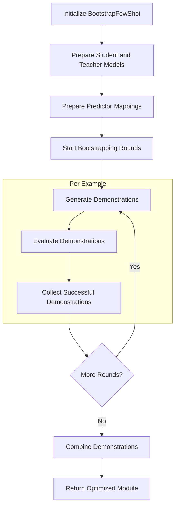

# BootstrapFewShot: Adaptive Few-Shot Learning for Language Models

## Introduction

BootstrapFewShot is an advanced optimizer in the DSPy framework, designed to enhance the performance of language model-based modules through adaptive few-shot learning. Unlike COPRO, which focuses on instruction refinement, BootstrapFewShot improves module performance by generating high-quality demonstrations. This article explores the methodology, key features, and underlying mechanisms that drive the BootstrapFewShot optimization process.

## Core Concepts and Workflow

BootstrapFewShot operates on the principle of iterative demonstration generation and evaluation. It interacts directly with DSPy modules, analyzing their structure, predictors, and signatures to tailor the optimization process. The optimizer uses a teacher model (which can be the same as the student model) to generate demonstrations for each predictor.

The general workflow of BootstrapFewShot can be visualized as follows:



## Key Features

1. **Demonstration Generation**: BootstrapFewShot generates high-quality demonstrations for each predictor in the module.
2. **Teacher-Student Model**: Uses a teacher model to create demonstrations for the student model.
3. **Multi-Round Optimization**: Supports multiple rounds of demonstration generation and evaluation.
4. **Metric-Guided Evaluation**: Uses task-specific metrics to evaluate and guide the optimization process.
5. **Adaptive Demonstration Selection**: Combines bootstrapped demonstrations with existing labeled demonstrations.

## Initialization and Setup

BootstrapFewShot is initialized with several key parameters:

```python
teleprompter = BootstrapFewShot(metric=metric, metric_threshold=metric_threshold, teacher_settings={}, max_bootstrapped_demos=4, max_labeled_demos=16, max_rounds=1, max_errors=5)
```

- `metric`: The task-specific evaluation metric.
- `metric_threshold`: The threshold for accepting generated demonstrations.
- `teacher_settings`: Settings for the teacher model.
- `max_bootstrapped_demos`: Maximum number of bootstrapped demonstrations to generate.
- `max_labeled_demos`: Maximum number of labeled demonstrations to use.
- `max_rounds`: Number of bootstrapping rounds.
- `max_errors`: Maximum number of errors allowed during optimization.

## Module and Predictor Preparation

BootstrapFewShot begins by preparing the student and teacher models and establishing predictor mappings:

```python
def _prepare_student_and_teacher(self, student, teacher):
    self.student = student.reset_copy()
    self.teacher = teacher.deepcopy() if teacher is not None else student.reset_copy()

    assert getattr(self.student, '_compiled', False) is False, "Student must be uncompiled."

    if self.max_labeled_demos and getattr(self.teacher, '_compiled', False) is False:
        teleprompter = LabeledFewShot(k=self.max_labeled_demos)
        self.teacher = teleprompter.compile(self.teacher.reset_copy(), trainset=self.trainset)

def _prepare_predictor_mappings(self):
    for (name1, predictor1), (name2, predictor2) in zip(student.named_predictors(), teacher.named_predictors()):
        assert name1 == name2, "Student and teacher must have the same program structure."
        assert predictor1.signature.equals(predictor2.signature), f"Student and teacher must have the same signatures."
```

## Demonstration Generation Process

### Bootstrapping

BootstrapFewShot generates demonstrations for each predictor using the teacher model:

```python
def _bootstrap_one_example(self, example, round_idx=0):
    with dsp.settings.context(trace=[], **self.teacher_settings):
        prediction = teacher(**example.inputs())
        trace = dsp.settings.trace
```

### Evaluation and Collection

Generated demonstrations are evaluated using the provided metric:

```python
if self.metric:
    metric_val = self.metric(example, prediction, trace)
    if self.metric_threshold:
        success = metric_val >= self.metric_threshold
    else:
        success = metric_val
```

Successful demonstrations are collected for each predictor:

```python
if success:
    for step in trace:
        predictor, inputs, outputs = step
        demo = Example(augmented=True, **inputs, **outputs)
        name2traces[predictor_name].append(demo)
```

## Demonstration Management

BootstrapFewShot maintains a pool of generated demonstrations for each predictor:

```python
self.name2traces = {name: [] for name in self.name2predictor}
```

## Multi-Predictor Coordination

For modules with multiple predictors, BootstrapFewShot generates and manages demonstrations for each predictor independently, ensuring overall module coherence.

## Adaptive Demonstration Selection

After generating bootstrapped demonstrations, BootstrapFewShot combines them with existing labeled demonstrations:

```python
def _train(self):
    for name, predictor in self.student.named_predictors():
        augmented_demos = self.name2traces[name][:self.max_bootstrapped_demos]
        
        sample_size = min(self.max_labeled_demos - len(augmented_demos), len(raw_demos))
        sample_size = max(0, sample_size)

        raw_demos = rng.sample(raw_demos, sample_size)
        
        predictor.demos = raw_demos + augmented_demos
```

## Error Handling

BootstrapFewShot implements error handling to manage failures during the optimization process:

```python
with self.error_lock:
    self.error_count += 1
    current_error_count = self.error_count
if current_error_count >= self.max_errors:
    raise e
```

## Final Selection and Return

After completing all bootstrapping rounds, BootstrapFewShot returns the optimized student model with updated demonstrations for each predictor.

## Conclusion

BootstrapFewShot represents a powerful approach to optimizing language model-based modules in DSPy through adaptive few-shot learning. By leveraging a teacher model to generate high-quality demonstrations, it provides an effective method for enhancing the performance of natural language processing tasks.

The optimizer's ability to work with complex module structures and multiple predictors makes it a versatile tool capable of handling a wide range of NLP applications. Its approach of generating task-specific demonstrations allows for improved performance without directly modifying the underlying model or instructions.

BootstrapFewShot's iterative process of demonstration generation, evaluation, and selection enables continuous improvement of module performance. This makes it an invaluable tool in scenarios where high-quality, task-specific examples are crucial for achieving optimal results in language model applications.